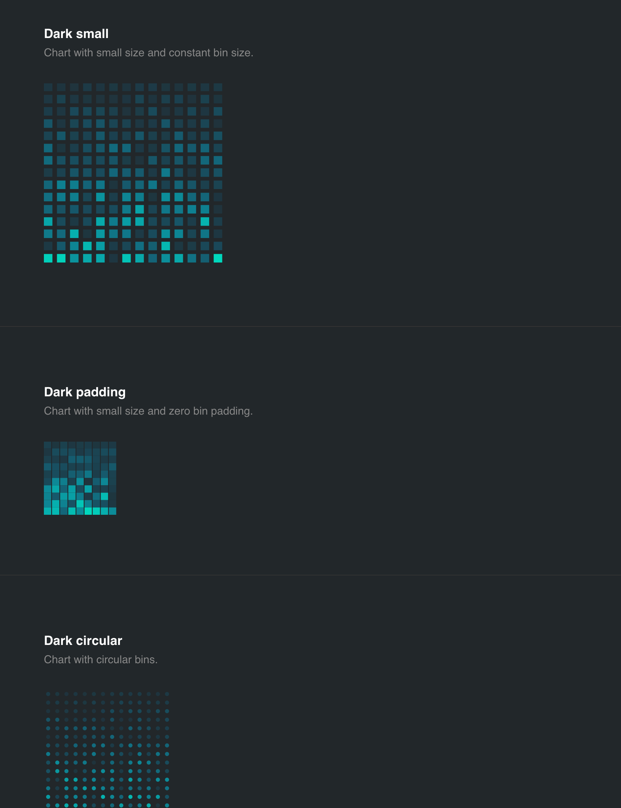

# D3 heatmap.

 D3 heatmap chart. See source for examples and documentation.

## Installation

```
$ npm install d3-heatmap
```

## Usage



## Developing

Build:

```
$ make build
```

Start dev server:

```
$ make start
```


